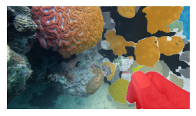
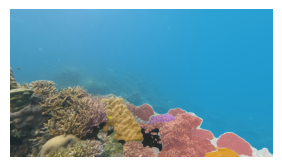
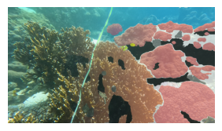
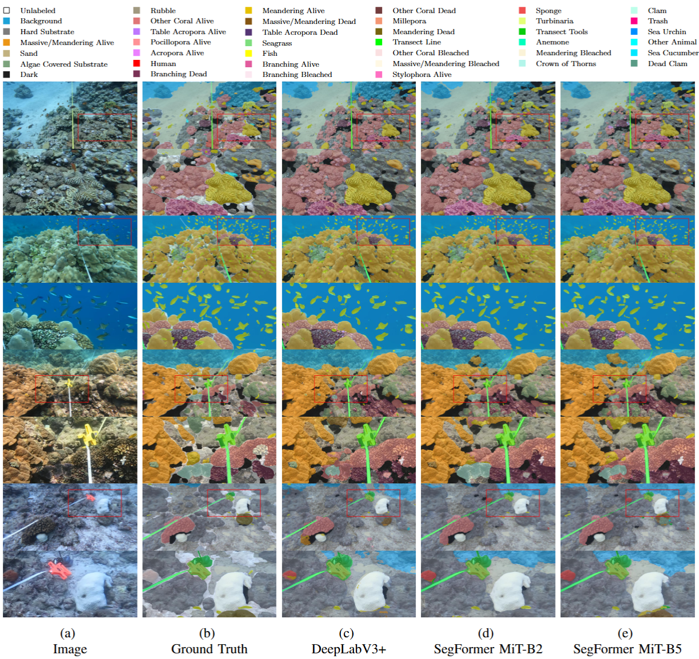

<div align="center">
<h1>The Coralscapes Dataset: Semantic Scene Understanding in Coral Reefs</h1>

**Jonathan Sauder**<sup>\*,1,2</sup> · **Viktor Domazetoski**<sup>\*,3,4;</sup> · **Guilhem Banc-Prandi**<sup>2</sup>
<br>
**Gabriela Perna**<sup>2</sup> · **Anders Meibom**<sup>2,5</sup> · **Devis Tuia**<sup>1</sup>

<sup>1</sup>Environmental Computational Science and Earth Observation Laboratory, École Polytechnique Fédérale de Lausanne, Switzerland
<br>
<sup>2</sup>Laboratory for Biological Geochemistry, École Polytechnique Fédérale de Lausanne, Switzerland
<br>
<sup>3</sup>Centre for Ecology and Conservation, University of Exeter, United Kingdom
<br>
<sup>4</sup>School of the Environment, The University of Queensland, Australia
<br>
<sup>5</sup>Center for Advanced Surface Analysis, University of Lausanne, Switzerland
<br>
*Equal contribution

<!-- # UPDATE once we have the final codebase -->
<a href="arxiv_link"></a>
<a href='page_link'></a>
<a href='https://huggingface.co/datasets/EPFL-ECEO/coralscapes'></a>
<a href='https://huggingface.co/spaces/EPFL-ECEO/coralscapes_demo'></a>
</div>

The Coralscapes dataset is the first general-purpose dense semantic segmentation dataset for coral reefs. Similar in scope and with the same structure as the widely used Cityscapes dataset for urban scene understanding, Coralscapes allows for the benchmarking of semantic segmentation models in a new challenging domain. The Coralscapes dataset spans 2075 images at 1024×2048px resolution gathered from 35 dive sites in 5 countries in the Red Sea, labeled in a consistent and speculation-free manner containing 174k polygons over 39 benthic classes.

This repository provides a collection of scripts and instructions for working with the Coralscapes dataset. It includes the full codebase necessary for training and evaluating models on this dataset, allowing to reproduce the results in the paper. Additionally, it contains scripts and step-by-step guidance on how to use the trained models for inference and how to fine-tune the models to external datasets.


<div align="center">
<table>
    <tr>
        <td></td>
        <td></td>
        <td></td>
    </tr>
</table>
</div>
<!--  -->

## Usage

### Installation

We recommend that you first set up a Python virtual environment using a package manager. In our case we utilize [micromamba](https://mamba.readthedocs.io/en/latest/user_guide/micromamba.html) because it’s lightweight, fast and easy to use. However, you are free to use any other managers (e.g. [conda](https://docs.conda.io/en/latest/)) by adjusting the commands accordingly.

```bash
git clone https://github.com/eceo-epfl/coralscapesScripts 
cd coralscapesScripts
micromamba env create -f environment.yml # Setup the environment by installing required packages
micromamba activate coralscapes 
```

### Dataset
There are two ways to explore the dataset within your code.

<!-- # UPDATE with zenodo link -->
- The first approach is to clone this repository and download the dataset from [zenodo](link). Then you can use the `Coralscapes` class to load the dataset splits given their location.
    ```python
    from coralscapesScripts.datasets.dataset import Coralscapes

    coralscapes_root_dir = "../coralscapes" # Update based on the location of your dataset 

    train_dataset = Coralscapes(root = coralscapes_root_dir, split = 'train')
    val_dataset = Coralscapes(root = coralscapes_root_dir, split = 'val') 
    test_dataset = Coralscapes(root = coralscapes_root_dir, split = 'test')

    image, label = test_dataset[42]
    ```

- Alternatively, you can use the Hugging Face version of the [dataset](https://huggingface.co/datasets/EPFL-ECEO/coralscapes). 
    ```python
    from datasets import load_dataset

    dataset = load_dataset("EPFL-ECEO/coralscapes") 

    image = dataset["test"][42]["image"]
    label = dataset["test"][42]["label"]
    ```

- Samples from the dataset with their associated colors can be visualized as follows: 
    ```python
    from coralscapesScripts.visualization import show_samples
    show_samples(train_dataset, n=2) # To visualize two images from the dataset
    ```

### Semantic Segmentation Inference
There are several options to use the models fine-tuned on Coralscapes: 
- You can use the `scripts/inference.py` script using a downloaded model checkpoint:
    ```bash
    cd scripts
    python inference.py \
    --inputs <path> \ # path to image or directory of images (e.g. ../img_dir/example_image.png or ../img_dir)
    --outputs <dir> \ # path to directory to save the images (e.g. ../output_dir/)
    --config <path> \ # path to a model configuration (e.g. ../configs/segformer-mit-b2.yaml)
    --model-checkpoint  <path> # path to model_checkpoint (e.g. ../model_checkpoints/segformer_mit_b2_epoch150)

- You can follow the steps at `nbs/inference.ipynb` using a downloaded model checkpoint.

- You can use the Hugging Face model checkpoints:
    - Simple Approach
        ```python 
        from transformers import SegformerImageProcessor, SegformerForSemanticSegmentation
        from PIL import Image
        from datasets import load_dataset

        # Load an image from the coralscapes dataset or load your own image 
        dataset = load_dataset("EPFL-ECEO/coralscapes") 
        image = dataset["test"][42]["image"]

        preprocessor = SegformerImageProcessor.from_pretrained("EPFL-ECEO/segformer-b2-finetuned-coralscapes-1024-1024")
        model = SegformerForSemanticSegmentation.from_pretrained("EPFL-ECEO/segformer-b2-finetuned-coralscapes-1024-1024")

        inputs = preprocessor(image, return_tensors = "pt")
        outputs = model(**inputs)
        outputs = preprocessor.post_process_semantic_segmentation(outputs, target_sizes=[(image.size[1], image.size[0])])
        label_pred = outputs[0].cpu().numpy()
        ```
    
    - Sliding Window Approach 
        ```python 
        import torch 
        import torch.nn.functional as F
        from transformers import SegformerImageProcessor, SegformerForSemanticSegmentation
        from PIL import Image
        from datasets import load_dataset
        import numpy as np

        def resize_image(image, target_size=1024):
            """
            Used to resize the image such that the smaller side equals 1024
            """
            h_img, w_img = image.size
            if h_img < w_img:
                new_h, new_w = target_size, int(w_img * (target_size / h_img))
            else:
                new_h, new_w  = int(h_img * (target_size / w_img)), target_size
            resized_img = image.resize((new_h, new_w))
            return resized_img

        def segment_image(image, preprocessor, model, crop_size = (1024, 1024), num_classes = 40, transform=None):
            """
            Finds an optimal stride based on the image size and aspect ratio to create
            overlapping sliding windows of size 1024x1024 which are then fed into the model.  
            """ 
            h_crop, w_crop = crop_size
            
            img = torch.Tensor(np.array(resize_image(image, target_size=1024)).transpose(2, 0, 1)).unsqueeze(0)
            batch_size, _, h_img, w_img = img.size()
            
            if transform:
                img = torch.Tensor(transform(image = img.numpy())["image"]).to(device)    
                
            h_grids = int(np.round(3/2*h_img/h_crop)) if h_img > h_crop else 1
            w_grids = int(np.round(3/2*w_img/w_crop)) if w_img > w_crop else 1
            
            h_stride = int((h_img - h_crop + h_grids -1)/(h_grids -1)) if h_grids > 1 else h_crop
            w_stride = int((w_img - w_crop + w_grids -1)/(w_grids -1)) if w_grids > 1 else w_crop
            
            preds = img.new_zeros((batch_size, num_classes, h_img, w_img))
            count_mat = img.new_zeros((batch_size, 1, h_img, w_img))
            
            for h_idx in range(h_grids):
                for w_idx in range(w_grids):
                y1 = h_idx * h_stride
                x1 = w_idx * w_stride
                y2 = min(y1 + h_crop, h_img)
                x2 = min(x1 + w_crop, w_img)
                y1 = max(y2 - h_crop, 0)
                x1 = max(x2 - w_crop, 0)
                crop_img = img[:, :, y1:y2, x1:x2]
                with torch.no_grad():
                    if(preprocessor):
                        inputs = preprocessor(crop_img, return_tensors = "pt")
                        inputs["pixel_values"] = inputs["pixel_values"].to(device)
                    else:
                        inputs = crop_img.to(device)
                    outputs = model(**inputs)

                resized_logits = F.interpolate(
                    outputs.logits[0].unsqueeze(dim=0), size=crop_img.shape[-2:], mode="bilinear", align_corners=False
                )
                preds += F.pad(resized_logits,
                                (int(x1), int(preds.shape[3] - x2), int(y1),
                                int(preds.shape[2] - y2)))
                count_mat[:, :, y1:y2, x1:x2] += 1
            
            assert (count_mat == 0).sum() == 0
            preds = preds / count_mat
            preds = preds.argmax(dim=1)
            preds = F.interpolate(preds.unsqueeze(0).type(torch.uint8), size=image.size[::-1], mode='nearest')
            label_pred = preds.squeeze().cpu().numpy()
            return label_pred

        # Load an image from the coralscapes dataset or load your own image 
        dataset = load_dataset("EPFL-ECEO/coralscapes") 
        image = dataset["test"][42]["image"]

        preprocessor = SegformerImageProcessor.from_pretrained("EPFL-ECEO/segformer-b2-finetuned-coralscapes-1024-1024")
        model = SegformerForSemanticSegmentation.from_pretrained("EPFL-ECEO/segformer-b2-finetuned-coralscapes-1024-1024")

        label_pred = segment_image(image, preprocessor, model)
        ```

- You can use the online Hugging Face gradio [demo](https://huggingface.co/spaces/EPFL-ECEO/coralscapes_demo).  


### Semantic Segmentation Fine-tuning
To fine-tune an existing model checkpoint on a custom dataset, please follow the guide at `nbs/fine_tune.ipynb`.

## Benchmarking Results
| Method                          | Test Accuracy | Test mIoU  |
|---------------------------------|--------------|------------|
| UNet - ResNet50                 | 75.593       | 42.906     |
| DeepLabV3+ - ResNet50           | 78.171       | 45.720     |
| SegFormer - MiT-b2              | 80.904       | <ins>54.682</ins>   |
| SegFormer - MiT-b2 (LoRA)       | 80.987       | 51.911     |
| SegFormer - MiT-b5              | 80.939       | **55.031** |
| SegFormer - MiT-b5 (LoRA)       | 80.863       | 52.775     |
| Linear - DINOv2-Base            | <ins>81.339</ins>     | 52.478     |
| DPT - DINOv2-Base               | 78.124       | 44.203     |
| DPT - DINOv2-Base (LoRA)        | 80.053       | 47.233     |
| DPT - DINOv2-Giant              | 80.691       | 50.643     |
| DPT - DINOv2-Giant (LoRA)       | **81.701**   | 54.531     |

*Quantitative results on Coralscapes segmentation, best shown in **bold**, second best <ins>underlined</ins>.*



*Qualitative samples from the Coralscapes test set.*

## Structure

### Dataset Structure
The dataset structure of the Coralscapes dataset follows the structure of the Cityscapes dataset:

```
{root}/{type}/{split}/{site}/{site}_{seq:0>6}_{frame:0>6}_{type}{ext}
```

The meaning of the individual elements is:
 - `root`  the root folder of the Coralscapes dataset. 
 - `type`  the type/modality of data, `gtFine` for fine ground truth, or `leftImg8bit` for left 8-bit images.
 - `split` the split, i.e. train/val/test. Note that not all kinds of data exist for all splits. Thus, do not be surprised to occasionally find empty folders.
 - `site`  ID of the site in which this part of the dataset was recorded.
 - `seq`   the sequence number using 6 digits.
 - `frame` the frame number using 6 digits. 
 - `ext`   `.png`

### Codebase Structure
```
├── benchmark_runs/ # Model training scripts
├── configs/ # Configurations for the dataset and model runs
├── coralscapesScripts/ 
    ├── datasets/  # Dataset & preprocessing classes and functions
    ├── segmentation/  # Model initialization, training & evaluation
    ├── io.py  # run initialization with config & cmd line args
    ├── logger.py  # wandb logging class
    ├── visualization.py  # image visualization functions
├── nbs/ 
    ├── train.ipynb  # Model training notebook 
    ├── inference.ipynb  # Model inference & evaluation
    ├── fine_tune.ipynb  # Fine tuning with a model checkpoint
├── scripts/ # Inference scripts
├── environment.yml # Conda environment specification
└── README.md
```

## License

## Citation
If you find this project useful, please consider citing:
 <!-- # UPDATE To-Do -->
```bibtex
@article{,
  title={The Coralscapes Dataset: Semantic Scene Understanding in Coral Reefs},
  author={Sauder, Jonathan and Domazetoski, Viktor and Banc-Prandi, Guilhem and Perna, Gabriela and Meibom, Anders and Tuia, Devis},
  journal={arXiv:},
  year={2025}
}

```